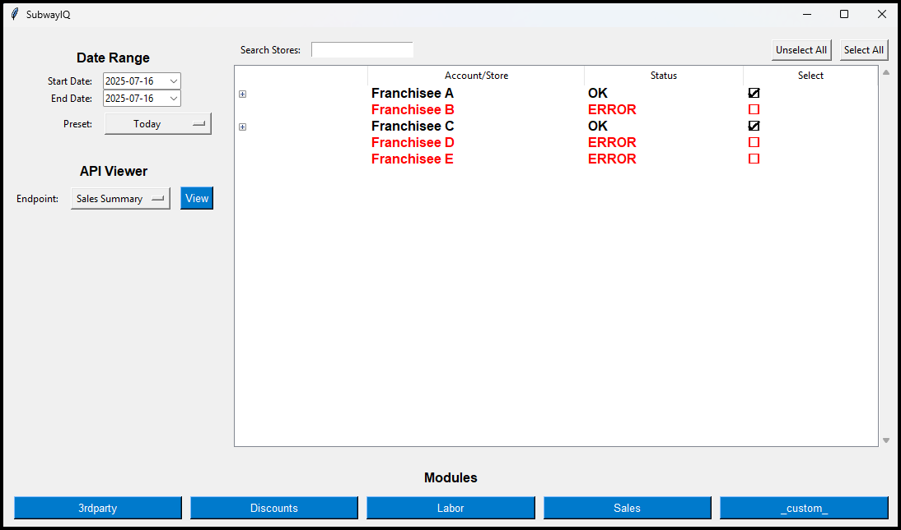
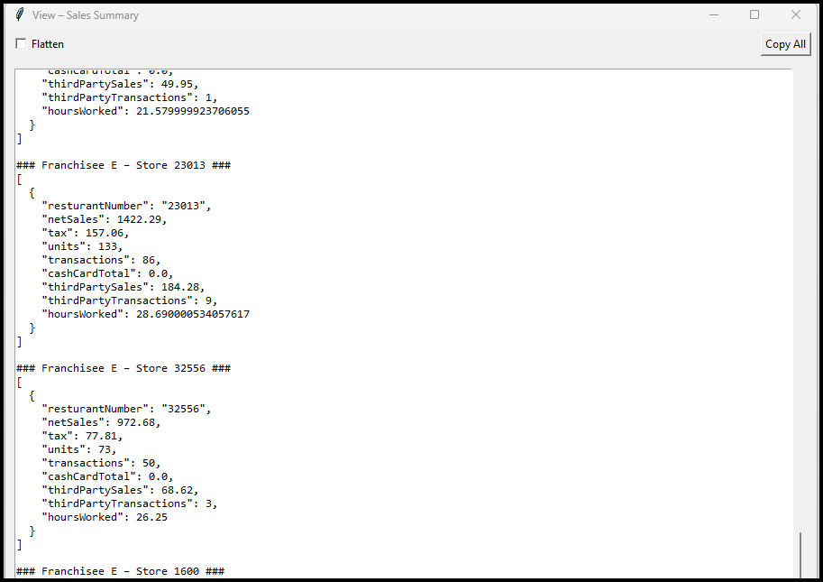
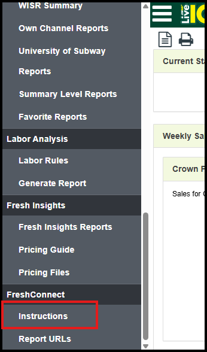
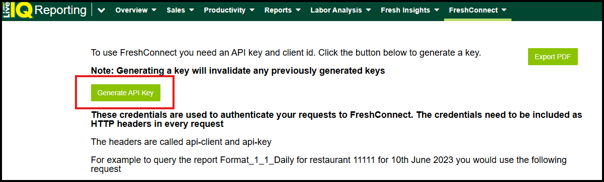

<p align="center">
  <br>
  <b>SubwayIQ</b><br>
  <i>Subway LiveIQ API Viewer & Custom Report Building Tool</i>
</p>

<p align="center">
  
  
</p>

---

## Table of Contents
1. [Why this exists](#why-this-exists)  
2. [Screenshots](#Screenshots)  
3. [What this app does](#what-this-app-does)  
4. [Module Details](#module-details)  
5. [Quick start](#quick-start)  
6. [Packaging to .exe](#packaging-to-exe)  
7. [Working with `config.json`](#working-with-configjson)  
8. [Folder map](#folder-map)  
9. [Troubleshooting](#troubleshooting)  
10. [LiveIQ API quirks & pitfalls](#liveiq-api-quirks--pitfalls)  
11. [Developing custom modules](#developing-custom-modules)  
12. [Contributing](#contributing)  
13. [License](#license)

---

## Why this exists
Running multiple Subway® stores usually means juggling LiveIQ log‑ins and exporting clunky CSVs. **SubwayIQ** talks straight to the franchisee API, merges every account & store into a single UI, and gives you clean JSON or one‑click dashboards.

---

## Screenshots




---

## What this app does
| 🛠 Feature | Detail |
|-----------|--------|
| **Multi-account login** | Reads unlimited `ClientID` / `ClientKEY` pairs from `config.json` and auto‑discovers all stores. |
| **Store & account filters** | Checkbox grids with **Select All / Unselect All** for both accounts and stores. |
| **Date presets** | Today · Yesterday · Past N Days (2–30) or custom. |
| **Endpoint picker** | Seven built‑in LiveIQ endpoints (add more in code). |
| **Viewer** | Pretty JSON or flattened view + **Copy All** button. |
| **Plug-in system** | Drop a `.py` in `modules/` and it becomes a button. |
| **Pre-built modules** | - **Labor**: Employee hours and shifts per store.<br>- **Sales**: Sales summaries with daily breakdowns.<br>- **Third-Party**: Third‑party sales (DoorDash, GrubHub, etc.) with all‑days (multi‑day only) and daily summaries.<br>- **Discounts**: Discount usage summaries per store.<br>- **Blank**: Template for custom modules. |
| **Report actions** | Copy to clipboard, print to default printer, email via mailto, or export as CSV. |
| **Error logging** | UTC‑stamped `error.log`. |
| **Packaging-ready** | Works as `python SubwayIQ.py` or one‑file EXE. |

---

## Module Details
SubwayIQ includes five pre-built modules in the `modules/` folder, each generating a report from LiveIQ API data. All modules feature a consistent UI with a toolbar (Copy, Print, MailTo, Export CSV buttons) and a dynamically resizing text area displaying formatted reports. Below is a detailed explanation of each module’s functionality.

### Labor.py
- **Purpose**: Summarizes employee work hours and shifts for selected stores and date ranges.
- **API Endpoint**: `Daily Timeclock`
- **Functionality**:
  - Fetches clock-in and clock-out data for employees across selected stores.
  - Validates date ranges (max 30 days) and handles errors (e.g., invalid dates, rate limits).
  - Displays per-store details: employee name, clock-in/out times, and hours worked.
  - Includes summaries: total hours and shifts per employee, and total hours, employees, and shifts per store.
- **Report Format**:
  - **Per-Store Details**: `Employee` (30 chars), `In` (20 chars), `Out` (20 chars), `Hrs` (right-aligned, 5.2f).
  - **Per-Employee Summary**: `Employee` (dynamic width), `Hrs` (5.2f), `Shifts` (6 chars).
  - **Store Summary**: `Store` (9 chars), `Hrs` (5.2f), `Emps` (4 chars), `Shifts` (6 chars).
  - Uses tags: `title` (Courier New, 12, bold), `heading` (Courier New, 11, bold), `sep` (gray).
- **Example Output**:
  ```
  Labor Hours: 2025-07-01 → 2025-07-01
  Store 12345 (Acct: Franchisee A)
  Employee                        In                   Out                  Hrs
  ────────────────────────────────────────────────────────────────────────────────
  John Doe                       07/01 08:00 AM       07/01 04:00 PM        8.00 hrs
  Jane Smith                     07/01 09:00 AM       (in)                  0.00 hrs
  ────────────────────────────────────────────────────────────────────────────────
  Summary of Hours per Employee
  Employee    Hrs    Shifts
  ────────────────────────────
  Jane Smith   0.00      1
  John Doe     8.00      1
  Summary of Hours per Store
  Store        Hrs  Emps  Shifts
  12345       8.00     2      2
  ```

### Sales.py
- **Purpose**: Displays sales summaries and daily breakdowns for selected stores and date ranges.
- **API Endpoints**: `Sales Summary` (multi-day), `Daily Sales Summary` (single-day)
- **Functionality**:
  - Fetches sales data (net sales, tax, units, transactions, cash/card, third-party sales) for selected stores.
  - Uses `Sales Summary` for multi-day ranges and `Daily Sales Summary` for single days.
  - Displays a top-level summary for the entire date range, followed by daily breakdowns.
  - Handles field drift (e.g., `netSales` vs. `netSalesTotal`) and errors (e.g., rate limits).
- **Report Format**:
  - **Summary/Daily Sections**: `Store` (6 chars), `Sales` (10.2f), `Tax` (8.2f), `Units` (5 chars), `Txns` (5 chars), `Cash/Card` (10.2f), `3rd $` (8.2f), `3rd Txns` (9 chars).
  - Uses tags: `title` (Courier New, 12, bold), `heading` (Courier New, 11, bold), `sep` (gray).
- **Example Output**:
  ```
  Sales Report: 2025-07-01 → 2025-07-01
  === Sales Summary (2025-07-01) ===
  Store   Sales      Tax  Units  Txns  Cash/Card   3rd $   3rd Txns
  ───────────────────────────────────────────────────────────────────
  12345   1500.25   120.50    200   180    1300.75   200.50       20
  Daily Sales Summary (2025-07-01)
  ───────────────────────────────────────────────────────────────────
  Store   Sales      Tax  Units  Txns  Cash/Card   3rd $   3rd Txns
  ───────────────────────────────────────────────────────────────────
  12345   1500.25   120.50    200   180    1300.75   200.50       20
  ───────────────────────────────────────────────────────────────────
  ```

### ThirdParty.py
- **Purpose**: Reports third-party sales (e.g., DoorDash, GrubHub, Uber Eats, EzCater) for selected stores and date ranges.
- **API Endpoint**: `Third Party Sales Summary`
- **Functionality**:
  - Fetches third-party sales data, including total sales, net sales, and transactions per provider.
  - Provides an all-days summary for multi-day ranges and daily summaries for all ranges.
  - Handles errors (e.g., rate limits, missing data) and displays provider-specific metrics.
- **Report Format**:
  - **All-Days/Daily Sections**: `Store` (6 chars), `TotSales` (10.2f), `TotNet` (10.2f), `TotTxns` (8 chars), followed by `T` (transactions), `N` (net sales), `S` (sales) for DoorDash (DD), GrubHub (GH), Uber Eats (UE), EzCater (EC).
  - Uses tags: `title` (Courier New, 12, bold), `heading` (Courier New, 11, bold), `sep` (gray).
- **Example Output**:
  ```
  3rd-Party Sales: 2025-07-01 → 2025-07-02
  Third-Party Summary (All Days)
  Store  TotSales  TotNet  TotTxns  DD-T DD-N DD-S  GH-T GH-N GH-S  UE-T UE-N UE-S  EC-T EC-N EC-S
  ────────────────────────────────────────────────────────────────────────────────────────────────
  12345   500.75  450.25      50     20 200.50 220.75  15 150.25 160.50  10  80.50  90.25   5  20.00  30.00
  ────────────────────────────────────────────────────────────────────────────────────────────────
  Third-Party Summary (2025-07-01)
  Store  TotSales  TotNet  TotTxns  DD-T DD-N DD-S  GH-T GH-N GH-S  UE-T UE-N UE-S  EC-T EC-N EC-S
  ────────────────────────────────────────────────────────────────────────────────────────────────
  12345   300.50  270.75      30     12 120.25 130.50   9  90.50  95.75   6  50.00  55.50   3  10.00  15.00
  ────────────────────────────────────────────────────────────────────────────────────────────────
  ```

### Discounts.py
- **Purpose**: Summarizes discount usage across transactions for selected stores and date ranges.
- **API Endpoint**: `Transaction Details`
- **Functionality**:
  - Scans transaction items and nested modifiers/addons/extras for discount codes and savings.
  - Displays per-discount details (store-level breakdown), per-discount totals, and a store summary.
  - Handles errors (e.g., rate limits, invalid accounts) and validates date ranges (max 30 days).
- **Report Format**:
  - **Per-Discount Details**: `desc` (code), followed by `Store` (6 chars), `Count` (5 chars), `Orig$` (7.2f), `Adj$` (7.2f), `Disc$` (7.2f), `Total$` (7.2f).
  - **Per-Discount Totals**: `Code` (6 chars), `Count` (6 chars), `Total` (12.2f).
  - **Store Summary**: `Store` (6 chars), `Count` (6 chars), `Total` (7.2f).
  - Uses tags: `title` (Courier New, 12, bold), `heading` (Courier New, 11, bold), `sep` (gray).
- **Example Output**:
  ```
  Discounts: 2025-07-01 → 2025-07-01
  BOGO50 (BOGO)
  Store   | Count |  Orig$  |  Adj$   |  Disc$  |  Total$
  ───────────────────────────────────────────────────────────
  12345      10    15.00     7.50      7.50     75.00
  Per-Discount Totals
  Code    Count     Total
  ───────────────────────────────
  BOGO      10        75.00
  Store Summary
  Store    Count  Total
  ────────────────────────
  12345      10   75.00
  ```

### Blank.py
- **Purpose**: Provides a template for creating custom modules with a consistent UI and example code.
- **API Endpoint**: Configurable (set `ENDPOINT_NAME` to any LiveIQ endpoint).
- **Functionality**:
  - Includes a commented example for fetching and displaying data using `fetch_data`.
  - Supports the same UI as other modules: toolbar (Copy, Print, MailTo, Export CSV), dynamic text area.
  - Validates date ranges (max 30 days) and handles errors.
- **Report Format**:
  - Example output: `Store` (6 chars), `Value` (7 chars), customizable by editing the `worker` function.
  - Uses tags: `title` (Courier New, 12, bold), `heading` (Courier New, 11, bold), `sep` (gray).
- **Example Output (Uncommented)**:
  ```
  Custom Report: 2025-07-01 → 2025-07-01
  Sample Data Summary
  Store  | Value
  ───────────────────
  12345     100
  ```

---

## Quick start
```bash
git clone https://github.com/alxl85/SubwayIQ.git
cd SubwayIQ
python -m venv .venv && (. .venv/bin/activate || .venv\Scripts\activate)
pip install -r requirements.txt
python SubwayIQ.py
```
First launch writes `config.json` and creates a `modules/` folder with `Labor.py`, `Sales.py`, `ThirdParty.py`, `Discounts.py`, and `Blank.py`.  
Add credentials (see below) and relaunch.

---

## Packaging to .exe
I have provided a current working version packaged into a standalone .exe but here's how you can download the script and package it yourself.

```powershell
pyinstaller --onefile --noconsole `
  --name "SubwayIQ" `
  --icon="SubwayIQ.ico" `
  --add-data "modules;modules" `
  SubwayIQ.py
```
> On macOS/Linux swap the semicolon for a colon in `--add-data`.  
> Remove `--noconsole` while debugging to see tracebacks.

---

## Working with `config.json`
```json
{
  "accounts": [
    {
      "Name": "Franchisee A",
      "ClientID": "xxxxxxxx",
      "ClientKEY": "yyyyyyyy"
    }
  ]
}
```
**Location** — same folder as `SubwayIQ.py` / `SubwayIQ.exe`.

<details>
<summary><b>How to obtain API keys</b></summary>

1. Log in to Subway Fresh Connect.  
2. **Fresh Connect ▸ Instructions** → **Generate Keys**.  
3. Copy *Client ID* & *Client KEY* into `config.json`.  



</details>

Add one entry per franchisee account; duplicate store numbers are auto‑deduplicated.

---

## Folder map
```text
SubwayIQ/
├ SubwayIQ.py
├ requirements.txt
├ logo.ico
├ config.json
├ error.log
└ modules/
    ├ Labor.py
    ├ Sales.py
    ├ ThirdParty.py
    ├ Discounts.py
    ├ Blank.py
```
Packaged layout:
```text
Release/
│ SubwayIQ.exe
│ config.json
└ modules/
    ├ Labor.py
    ├ Sales.py
    ├ ThirdParty.py
    ├ Discounts.py
    ├ Blank.py
```

---

## Troubleshooting
| 😖 Symptom | 🩹 Fix |
|------------|-------|
| EXE does nothing | Build **without** `--noconsole`, run from *cmd* to read traceback. |
| No plugin buttons | Ensure `modules/` exists or include it via `--add-data`. |
| Config regenerates every time | Edit the `config.json` next to the EXE, not the Temp copy. |
| Icon refused | Provide a real 256×256, 32‑bit ICO or let Pillow auto‑convert. |
| Report text invisible | Check `error.log` for rendering issues; ensure `ScrolledText` is in `normal` state. |

---

## LiveIQ API quirks & pitfalls
| Issue | Impact | Mitigation |
|-------|--------|-----------|
| Undocumented rate-limit (~60 req/min) | 429 errors | Use `config_max_workers` (≤10 threads) + retry with `handle_rate_limit`. |
| 30–60 min data latency | “Today” appears low | Pull after close or note in reports (e.g., “No data for today”). |
| Field drift (`netSale` → `netSales`) | KeyError | Use `.get()` with defaults. |
| Store-local timestamps | Cross‑TZ math off | Convert with `pytz`. |
| Random 500/502 | Module crash | Wrap loops in `try/except`, log via `log_error`. |

---

## Developing custom modules
This site outlines the entire LiveIQ API schema.
https://app.swaggerhub.com/apis/Subway/freshconnect_liveiq_franchisee_api/v1

Each module is **one file** in `modules/`. The viewer imports it and calls `run(window)`.

<details>
<summary><b>Minimal module example</b></summary>

```python
# modules/my_module.py
import threading
import tkinter as tk
from tkinter.scrolledtext import ScrolledText
from datetime import datetime
from concurrent.futures import ThreadPoolExecutor, as_completed
import json

ENDPOINT_NAME = "Your Endpoint Name"
MAX_DAYS = 30

def create_toolbar(window, txt, title):
    toolbar = tk.Frame(window, bg="#f0f0f0")
    toolbar.pack(fill="x", pady=(8, 0), padx=8)
    copy_btn = tk.Button(toolbar, text="Copy", state=tk.DISABLED, bg="#007ACC", fg="white", font=("Arial", 10))
    copy_btn.pack(side="right", padx=4)

    def enable_copy():
        copy_btn.config(state=tk.NORMAL, command=lambda: (
            window.clipboard_clear(),
            window.clipboard_append(txt.get("1.0", "end-1c"))
        ))

    # Add Print, MailTo, Export CSV buttons (omitted for brevity)
    return enable_copy

def run(window):
    from __main__ import get_selected_start_date, get_selected_end_date, fetch_data, store_vars, config_accounts, handle_rate_limit, log_error, config_max_workers

    try:
        start = datetime.strptime(get_selected_start_date(), "%Y-%m-%d").date()
        end = datetime.strptime(get_selected_end_date(), "%Y-%m-%d").date()
        if end < start:
            tk.messagebox.showerror("Invalid Date Range", "End date cannot be before start date.", parent=window)
            return
        if (end - start).days + 1 > MAX_DAYS:
            tk.messagebox.showerror("Date Range Too Large", f"Please select a range of at most {MAX_DAYS} days.", parent=window)
            return
    except ValueError as e:
        log_error(f"Date parsing error: {e}", endpoint=ENDPOINT_NAME)
        tk.messagebox.showerror("Bad Date", "Could not parse your start/end dates.", parent=window)
        return

    window.title("Custom Report")
    parent = window.master
    parent.update_idletasks()
    px, py = parent.winfo_rootx(), parent.winfo_rooty()
    window.geometry(f"{int(window.winfo_screenwidth()*0.6)}x{int(window.winfo_screenheight()*0.6)}+{px}+{py}")
    window.resizable(True, True)
    window.minsize(800, 600)

    txt = ScrolledText(window, wrap="none", font=("Courier New", 11), fg="black", state="normal")
    enable_copy = create_toolbar(window, txt, "Custom Report")
    log_error("Toolbar created", endpoint=ENDPOINT_NAME)

    txt.pack(fill="both", expand=True, padx=8, pady=(4, 8))
    hbar = tk.Scrollbar(window, orient="horizontal", command=txt.xview)
    hbar.pack(fill="x", padx=8)
    txt.configure(xscrollcommand=hbar.set)
    txt.tag_configure("title", font=("Courier New", 12, "bold"), foreground="black")
    txt.tag_configure("heading", font=("Courier New", 11, "bold"), foreground="black")
    txt.tag_configure("sep", foreground="#888888")
    selected_stores = [s for s, v in store_vars.items() if v.get()]

    def log(line="", tag=None):
        txt.configure(state="normal")
        txt.insert("end", line + "\n", tag or ())
        txt.see("end")
        txt.update()
        txt.configure(state="normal")
        log_error(f"Log: {line}", endpoint=ENDPOINT_NAME)

    def worker():
        try:
            if not selected_stores:
                log("No stores selected.", "sep")
                log_error("No stores selected", endpoint=ENDPOINT_NAME)
                window.after(0, enable_copy)
                return

            store_map = {}
            for acct in config_accounts:
                name = acct.get("Name", "")
                cid = acct.get("ClientID", "")
                ckey = acct.get("ClientKEY", "")
                if not all([name, cid, ckey]):
                    log(f"Skipping invalid account: {name or 'Unknown'}", "sep")
                    log_error(f"Invalid account: Name={name}, ClientID={cid}", endpoint=ENDPOINT_NAME)
                    continue
                for sid in acct.get("StoreIDs", []):
                    if sid in selected_stores and sid not in store_map:
                        store_map[sid] = (name, cid, ckey)

            if not store_map:
                log("No valid accounts with selected stores found.", "sep")
                log_error("No valid accounts with selected stores", endpoint=ENDPOINT_NAME)
                window.after(0, enable_copy)
                return

            s_str, e_str = start.isoformat(), end.isoformat()
            log(f"Custom Report: {s_str} → {e_str}", "title")
            log(f"Fetching data for {len(store_map)} stores…", "sep")

            log("", None)
            log("Sample Data Summary", "title")
            log("Store  | Value", "heading")
            log("─" * 20, "sep")
            with ThreadPoolExecutor(max_workers=min(config_max_workers, len(selected_stores))) as ex:
                futures = {}
                for sid, (aname, cid, ckey) in store_map.items():
                    fut = ex.submit(fetch_data, ENDPOINT_NAME, sid, s_str, e_str, cid, ckey)
                    futures[fut] = (sid, aname, cid, ckey)
                for fut in as_completed(futures):
                    sid, aname, cid, ckey = futures[fut]
                    try:
                        res = fut.result() or {}
                        log_error(f"API response for store {sid}: {json.dumps(res, indent=2)}", endpoint=ENDPOINT_NAME)
                    except Exception as ex:
                        log_error(f"Fetch failed for store {sid}: {ex}", sid, ENDPOINT_NAME)
                        log(f"❌ Store {sid}: Exception: {ex}", "sep")
                        continue
                    err = res.get("error")
                    if err:
                        if "429" in err.lower() or "rate limit" in err.lower():
                            log(f"⚠️ Store {sid}: Rate limit hit; skipping.", "sep")
                            handle_rate_limit(cid, ckey, window)
                        else:
                            log_error(f"API error for store {sid}: {err}", sid, ENDPOINT_NAME)
                            log(f"❌ Store {sid}: {err}", "sep")
                        continue
                    data = res.get("data", []) or []
                    if isinstance(data, dict):
                        data = [data]
                    if not data:
                        log(f"Store {sid} (Acct: {aname}): No data available.", "sep")
                        log_error(f"No data for store {sid}", sid, ENDPOINT_NAME)
                        continue
                    for rec in data:
                        value = rec.get("sampleField", 0)
                        log(f"{sid:>6}  {value:>7}")

            idx = txt.search("Fetching data for ", "1.0", tk.END)
            if idx:
                txt.delete(idx, f"{idx} lineend +1c")
            window.after(0, enable_copy)
        except Exception as ex:
            log_error(f"Worker thread error: {ex}", endpoint=ENDPOINT_NAME)
            log(f"❌ Report error: {ex}", "sep")
            tk.messagebox.showerror("Report Error", f"Failed to generate report: {ex}", parent=window)
            window.after(0, enable_copy)

    threading.Thread(target=worker, daemon=True).start()

if __name__ == "__main__":
    root = tk.Tk()
    run(root)
    root.mainloop()
```

</details>

## Available host helpers
| Helper | Purpose |
|--------|---------|
| `fetch_data()` | Wrapper around LiveIQ request |
| `store_vars` | Dict of checked stores |
| `config_accounts` | Account config (includes `StoreIDs`) |
| `handle_rate_limit()` | Handles 429 errors with exponential back‑off |
| `log_error()` | Append to `error.log` |
| `config_max_workers` | Max threads for `ThreadPoolExecutor` (≤10) |
| `flatten_json()` | Turn nested JSON into dotted paths |

## Common patterns
| Goal | Snippet |
|------|---------|
| Background thread | `threading.Thread(target=fn, daemon=True).start()` |
| Log to ScrolledText | `log("Message", "tag")` (tags: `title`, `heading`, `sep`) |
| Fetch data in parallel | `with ThreadPoolExecutor(max_workers=config_max_workers) as ex: ...` |
| Flatten JSON | `flat = flatten_json(data)` |

## LiveIQ endpoint names
| Dropdown label | `fetch_data` value |
|----------------|--------------------|
| Sales Summary | `"Sales Summary"` |
| Daily Sales Summary | `"Daily Sales Summary"` |
| Daily Timeclock | `"Daily Timeclock"` |
| Third Party Sales Summary | `"Third Party Sales Summary"` |
| Third Party Transaction Summary | `"Third Party Transaction Summary"` |
| Transaction Summary | `"Transaction Summary"` |
| Transaction Details | `"Transaction Details"` |

## Debugging tips
* Run from a terminal (omit `--noconsole`) so `print()` is visible.  
* Wrap risky code with `try/except` and log via `log_error()`.  
* Import heavy libs **inside** `run()`—helps PyInstaller.

---

## Contributing
Pull requests welcome!  

1. Fork → feature branch  
2. `pip install -r requirements-dev.txt`  
3. `pre-commit install`  
4. Open a PR with screenshot/GIF if UI‑related.

---

## License
MIT—use it, fork it, just don’t blame us if your sandwich shop catches fire.

> _Built for franchisees who’d rather read numbers than copy‑paste them._
